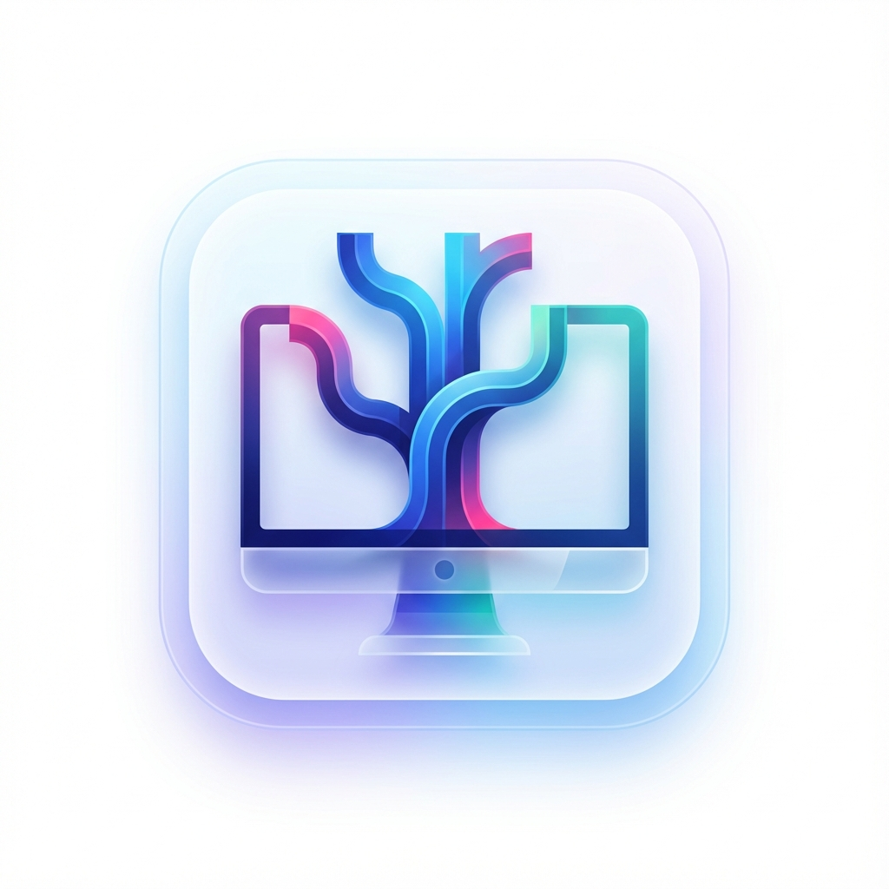
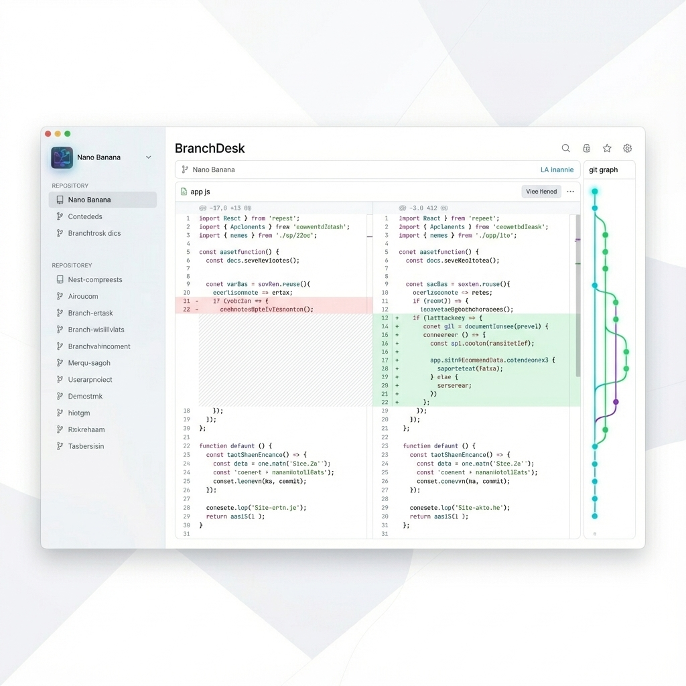
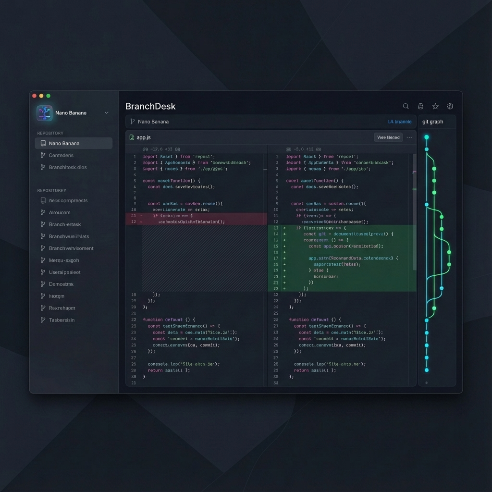

# BranchDesk 🚀

BranchDesk is an **open-source, cross-platform Git client** for **Windows, macOS, and Linux**. It provides a **clean, intuitive, and visual interface** for managing repositories, commits, branches, and merges—making Git workflows faster and more approachable for developers of all skill levels.

> 🛠️ **Project Status:** Actively in development
>
> ⭐ Star the repo • 💬 Join discussions • 🧭 Help shape the roadmap

---

## ✨ Why BranchDesk?

Git is powerful, but not always friendly. BranchDesk aims to:

* Reduce cognitive load when working with Git
* Provide a clean, distraction-free UI
* Make branching, merging, and history easier to understand
* Stay lightweight, fast, and open source

Whether you're a beginner learning Git or an experienced developer managing complex repositories, BranchDesk is built for you.

---

## 🎨 Visual Identity (Nano Banana Concept)

  

### 🌞 Light Mode

### 🌙 Dark Mode

---

## 🧩 Features (Planned & In Progress)

* Cross-platform support (Windows, macOS, Linux)
* Repository cloning and management
* Visual commit history
* Branch creation and switching
* Staging and committing changes
* Merge and conflict handling
* Clean diff viewer
* Light & Dark themes

> Full feature breakdown is available in the **Public Roadmap** below.

---

## 🗺️ Public Roadmap

This roadmap represents the current vision for BranchDesk. It is **community-driven** and subject to change based on feedback and contributions.

---

### 🧩 Phase 1 – MVP (Foundation)

**Goal:** Deliver a stable, usable Git client covering essential daily workflows.

**Repository Management**

* Clone repositories (HTTPS & SSH)
* Add existing local repositories
* Create new repositories
* Open repository in file explorer
* Open repository in default code editor

**Branch Management**

* View current branch
* Create new branches
* Checkout / switch branches
* Delete local branches

**Commit Workflow**

* View changed files
* Stage / unstage files
* Commit changes
* Commit history list

**Sync**

* Fetch from remote
* Pull changes
* Push commits
* Basic sync status (ahead / behind)

**Diff Viewer**

* File-level diff view
* Added / removed line highlighting

---

### 🌿 Phase 2 – Core Git Experience

**Goal:** Match core features developers expect from a modern Git GUI.

* Partial staging (line-level)
* Amend last commit
* Revert commits
* Cherry-pick commits
* Rename branches
* Publish local branches
* Track upstream branches
* Compare branches
* Reset branch to commit
* Merge branches via UI
* Rebase support
* Conflict detection & resolution indicators
* Commit history search & filtering

---

### 🔀 Phase 3 – GitHub & Remote Integration

**Goal:** Improve collaboration and remote workflows.

* GitHub authentication (OAuth / token)
* Open repository on GitHub
* Fork repositories
* Create pull requests (via browser)
* View PR-related branches
* Multiple remotes support
* Private repository handling

---

### ⚙️ Phase 4 – Productivity & Customization

**Goal:** Improve speed, comfort, and personalization.

* Keyboard shortcuts
* Discard / undo changes
* Stash, apply, and pop stashes
* .gitignore editor
* Configure Git username & email
* Default branch configuration
* Editor selection
* Theme support (Light / Dark)
* Localization support
* Status indicators & notifications

---

### 🚀 Phase 5 – Advanced & Power Features

**Goal:** Support advanced Git users and teams.

* Visual commit graph
* Tags management
* Blame view
* Submodule support
* Git LFS support
* Hooks management
* Plugin / extension system

---

## 🤝 Contributing

BranchDesk is built **in public** and contributions are welcome.

You can help by:

* ⭐ Starring the repository
* 🐞 Reporting bugs
* 💡 Suggesting features
* 🔧 Submitting pull requests
* 📝 Improving documentation

Please check the `CONTRIBUTING.md` (coming soon) for guidelines.

---

## 💬 Community & Discussions

Have ideas or feedback? Join the discussion and help shape the future of BranchDesk.

* Share feature requests
* Discuss UI/UX ideas
* Vote on roadmap priorities

---

## 📜 License

BranchDesk is released under the **MIT License**.

---

## ❤️ Acknowledgements

Built by developers, for developers. Inspired by the need for a fast, friendly, and open Git client.

If you like the project, consider giving it a ⭐ and spreading the word!
